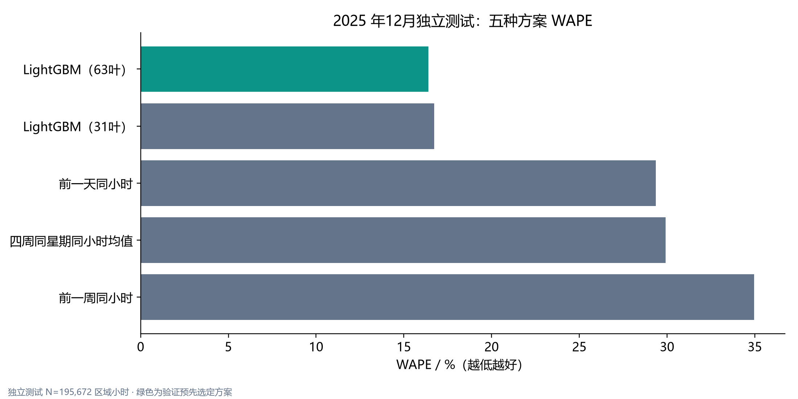
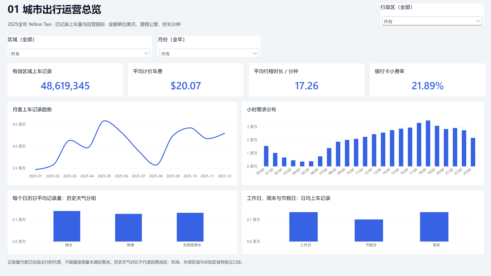

# 城市出行运营分析与区域需求预测

**DuckDB SQL · Python · LightGBM · Power BI · 2025全年公开行程**

[GitHub作品集仓库](https://github.com/lguo716/nyc-taxi-operations-analysis)

从48,722,602条TLC Yellow Taxi源记录，分析出行规模、区域效率与质量，并预测263区域下一小时的已记录上车量。完成三个扩展验证窗口、独立12月测试和固定服务名额的区域分配模拟。结果均来自实际运行，不预设预测提升。

## 主要结果

| 指标 | 实际结果 |
|---|---:|
| 源记录 | 48,722,602 |
| 有效区域上车记录 | 48,619,345 |
| 实体区域 / 小时网格 | 263 / 2,303,880 |
| 验证选定方案 | LightGBM（63叶） |
| 12月独立测试区域小时 | 195,672 |
| 测试WAPE / MAE | 16.4044% / 3.6028次 |
| 1000名额：预测相对历史模拟覆盖差 | +3,621次 |



## 数据、粒度与质量

[TLC官方来源](https://www.nyc.gov/site/tlc/about/tlc-trip-record-data.page)按月全量扫描，来源、SHA256、字节数、行数、字段保存在[data/source_manifest.json](data/source_manifest.json)。天气来自[Open-Meteo ERA5](https://open-meteo.com/en/docs/historical-weather-api)，只做历史分组分析；许可与引用见[NOTICE](NOTICE.md)。

行程、区域小时、路线事实及日期/小时/区域维表，保留各指标总量和有效次数。负金额、未知区域、时间/里程/速度异常分别标记；相同原字段不直接删除。上车量是已完成出行的代理，不是潜在总需求。区域1为Newark，264/265单独统计。[完整口径](docs/metric_definitions.md)

## 模型与业务建议

按9/10/11月扩展验证选择方案，用1—11月重训，12月只评估。对比前一天、前一周、四周同星期小时均值与31/63叶LightGBM Poisson。仅使用过去小时、区域和已知日历，夏令时歧义及其窗口排除。报告WAPE/MAE/RMSE及区域/行政区/小时误差，简单基准优势如实保留。[业务报告](reports/findings.md)

调度模拟每小时500/1000/2000个订单服务名额，比较均匀、历史和预测分配，计算覆盖、未覆盖和闲置；没有车辆位置、基础运力和移动成本，不声称空驶或成本收益。

## 复现

Windows / Python 3.12，项目根目录运行：

```powershell
python -m venv .venv
.\.venv\Scripts\python.exe -m pip install -r requirements.txt
.\.venv\Scripts\python.exe -m src.run_pipeline --stage all --seed 42
.\.venv\Scripts\python.exe -m pytest -q
.\.venv\Scripts\python.exe -m src.execute_notebooks
```

首次联网下载约0.8GB原始数据，后续校验缓存；DuckDB设置4线程/8GB内存上限。阶段可用download/prepare/analyze/features/train/evaluate/simulate/report/verify单独运行，时长和日志见reports/stage_timings.json、logs/。`report`重建自动报告和PBIP，手工修改前保留自己的版本。`verify`在独立进程重新计算SQL、加载模型并重算完整测试预测。

## Power BI与学习入口

下载仓库后可直接打开PBIX查看四页结果。刷新PBIX或打开PBIP前，在项目根目录运行`python -m src.restore_powerbi_data`，从随附的[汇总表压缩包](reports/tables/powerbi_large_tables.zip)还原两个较大的CSV，逐个校验大小和SHA256，再将Power BI的ProjectRoot参数改为自己的项目路径。此步骤仅需Python标准库，无需下载原始行程或重训模型。

[四页可编辑PBIP](powerbi/Taxi.pbip) · [完整PBIX](powerbi/nyc_taxi_operations.pbix) · [看板说明](powerbi/README.md) · [实际验收](reports/project_acceptance.md)



[完整流程与九阶段学习](docs/project_complete_walkthrough.md) · [运营Notebook](notebooks/01_operations.ipynb) · [预测Notebook](notebooks/02_forecasting.ipynb) · [模拟Notebook](notebooks/03_dispatch.ipynb) · [面试稿](reports/interview_guide.md) · [简历草稿](reports/resume_bullets.md)

仅查看结果无需下载原始数据。Power BI导入reports/tables；看板刷新不训练模型。公开仓库包含源码、汇总结果、PBIP/PBIX、已执行Notebook及图表，原始行程数据、本地环境、模型权重、行级中间产物与运行日志留在本地，可通过完整流程重建。两个超大CSV以ZIP发布并可无损还原；[本地验收清单](reports/delivery_manifest.json)也记录未纳入仓库的本地产物身份。未修改已有两个项目或现有简历。
