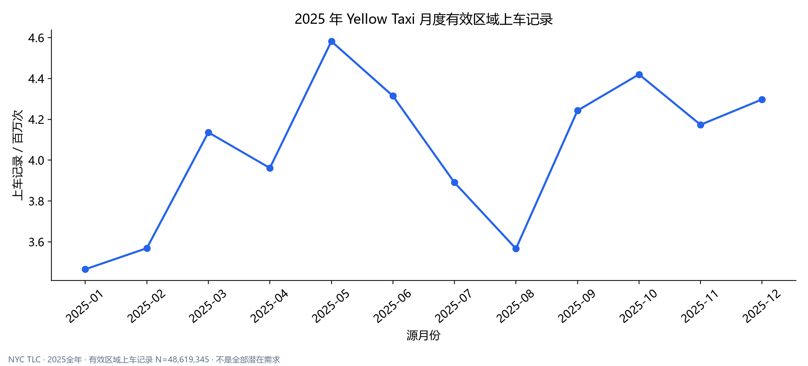
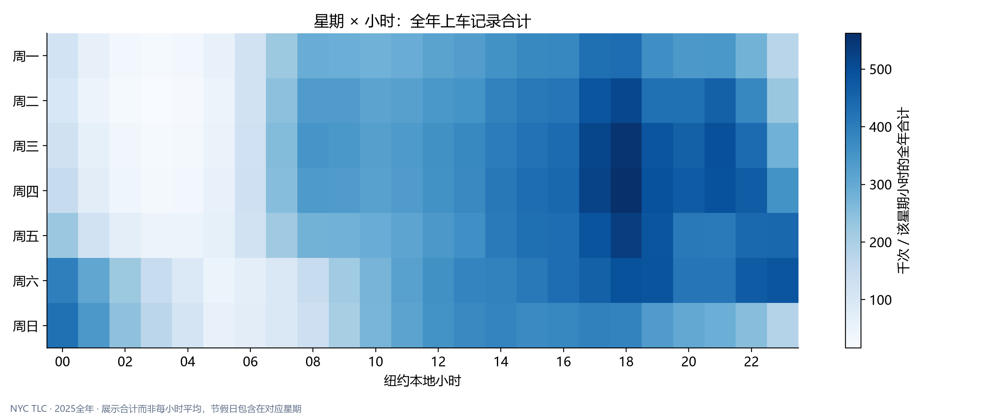
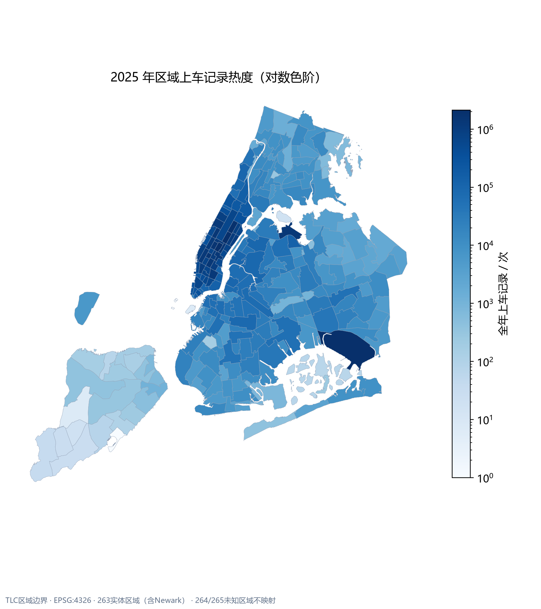
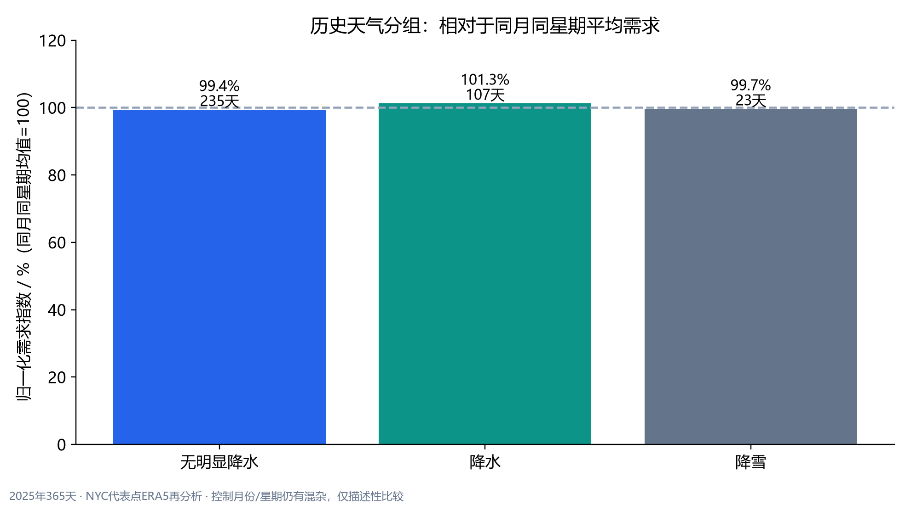
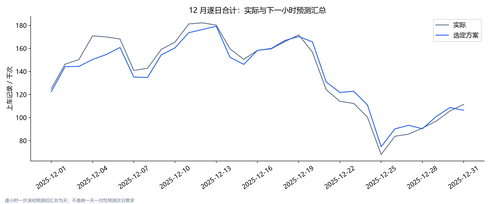
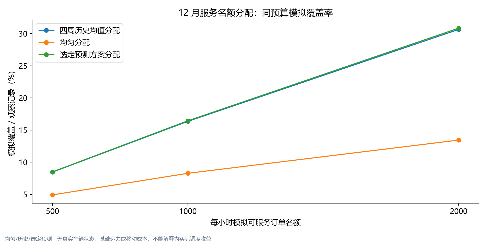

# 城市出行运营分析与区域需求预测：业务报告

## 结论与建议

2025年12个月共扫描 **48,722,602条原始记录**，有效区域上车记录 **48,619,345次**。Manhattan占比 **86.02%**，需求最高区域是 **Upper East Side South（237）**。建议先按小时和区域检查需求集中程度，再结合真实车辆数据判断是否应调度；本数据不能直接测量未满足需求。

三个扩展验证月选定 **LightGBM（63叶）**。12月独立测试 **195,672个区域小时**，WAPE **16.4044%**、MAE **3.6028次/区域小时**、RMSE **10.3188次/区域小时**。相对测试中最佳简单基准“前一天同小时”，WAPE相对变化为 **44.11%的降低**；该比较只描述独立测试结果，未用来重新选择模型。

默认每小时1000名额的模拟中，预测方案覆盖 **706,548次**，历史方案覆盖 **702,927次**，差额 **+3,621次**。预测方案模拟覆盖率 **16.44%**。这些是固定假设下的分配结果，不能推断真实空驶率、车辆数或成本节省。

## 数据与质量

数据来源为[TLC官方2025年Yellow Taxi月度Parquet](https://www.nyc.gov/site/tlc/about/tlc-trip-record-data.page)、Taxi Zone字典/边界，以及[Open-Meteo ERA5日度天气](https://open-meteo.com/en/docs/historical-weather-api)。来源文件SHA256由本地计算，发布者未提供预期SHA256；保留完整下载身份、字段、行数和全扫描核对。节假日来自[OPM 2025日历](https://www.opm.gov/policy-data-oversight/pay-leave/federal-holidays/#url=2025)。

原始记录排除拆分：源月份以外 **214**、明确作废 **0**、无法映射上车区域 **103,043**，剩余进入需求口径。相同原字段的月内额外记录 **1**，保留而不据此认定重复订单。原始数据负金额标记 **2,856,096**，不自动删除需求记录。

有效费用样本 **44,970,845**，平均计价车费 **$20.07**，平均乘客总支付 **$28.89**。效率有效样本 **46,406,152**，平均里程 **5.64km**、时长 **17.26分钟**、速度 **17.78km/h**。银行卡小费率 **21.89%**，分子与分母来自同一tip_valid样本，不含现金小费。

## 区域、时段与天气

月份最高为 **2025-05**，记录 **4,582,134次**。全年合计受月份天数、节假日与活动影响，不直接视为单独的季节因果效应。区域、工作日和小时规律见真实汇总表；机场与不同费率区域应分开解释。

按互斥日期分类，节假日优先于周末；以下日均分母为各类实际日历天数，费用仍按有效费用记录加权。节假日使用2025联邦节假日口径，不能直接推广为纽约所有活动日。

| 日类型 | 日历天数 | 上车记录 | 日均记录 | 平均计价车费USD |
|---|---|---|---|---|
| 周末 | 104 | 13958889 | 1.3422e+05 | 20.059 |
| 工作日 | 250 | 33551271 | 1.3421e+05 | 20.071 |
| 节假日 | 11 | 1109185 | 1.0084e+05 | 20.311 |

全年上车至下车区域流向前十名如下，来自route_monthly的12个月合计，仅此表限定上下车区域均为1—263。未知下车区仍保留在原路线表及上车需求中。区域内行程可能在同一区上下车，因此同区组合不能解释为零距离。

| 上车区ID | 上车区 | 下车区ID | 下车区 | 上车记录 | 有效平均分钟 |
|---|---|---|---|---|---|
| 237 | Upper East Side South | 236 | Upper East Side North | 302260 | 7.4331 |
| 236 | Upper East Side North | 237 | Upper East Side South | 259469 | 8.1042 |
| 237 | Upper East Side South | 237 | Upper East Side South | 215715 | 5.7514 |
| 236 | Upper East Side North | 236 | Upper East Side North | 197782 | 4.829 |
| 161 | Midtown Center | 237 | Upper East Side South | 143047 | 10.187 |
| 237 | Upper East Side South | 161 | Midtown Center | 133753 | 10.474 |
| 161 | Midtown Center | 236 | Upper East Side North | 115424 | 14.204 |
| 132 | JFK Airport | 132 | JFK Airport | 108207 | 6.6935 |
| 237 | Upper East Side South | 162 | Midtown East | 107294 | 9.0064 |
| 142 | Lincoln Square East | 239 | Upper West Side South | 105422 | 6.2184 |

路线热度适合提出接驳或分区服务假设；它不包含车辆空驶路径，也无法直接计算回程载客概率。

天气采用纽约代表点的日度再分析，按月份与星期分层报告天数和日均记录。图中对同月同星期均值归一化，仍有活动和乘客结构混杂；没有天气因果结论，也没有在模型中使用未来天气。

## 时间验证与独立结果

截至8/9/10月训练，分别验证9/10/11月，以三个月等权平均WAPE锁定方案。LightGBM Poisson为31/63叶、学习率0.05，上限2000轮、L1早停100轮。最终用1—11月重训，轮数为各验证最佳轮数中位数。12月不参与选择或早停。所有方案使用相同有效样本，零需求分母WAPE为空。

| model_label | selected | n | wape | mae | rmse |
|---|---|---|---|---|---|
| 前一天同小时 | 0 | 195672 | 0.2935 | 6.446 | 21.339 |
| 前一周同小时 | 0 | 195672 | 0.34963 | 7.6786 | 25.806 |
| 四周同星期同小时均值 | 0 | 195672 | 0.29908 | 6.5684 | 21.568 |
| LightGBM（31叶） | 0 | 195672 | 0.16729 | 3.6741 | 10.511 |
| LightGBM（63叶） | 1 | 195672 | 0.16404 | 3.6028 | 10.319 |

预测[t,t+1)时只使用已完成小时与已知日历，测试期间此前结束的小时可以用于下一小时滞后。数据按月发布，所以这是假设历史小时计数及时可得的离线评估，不是已上线实时系统。夏令时歧义及其滞后/滚动影响样本排除，完整月内真实无记录区域小时补零。

### 选定方案的误差切片

行政区结果按绝对误差贡献排序；全区域WAPE不能取下表WAPE的简单平均。EWR为Newark服务区域，单独解释。

| 分组 | 实际记录 | 绝对误差合计 | WAPE | MAE | RMSE |
|---|---|---|---|---|---|
| Manhattan | 3707209 | 5.0111e+05 | 13.52% | 9.7614 | 18.043 |
| Queens | 389418 | 1.0676e+05 | 27.42% | 2.0797 | 8.5912 |
| Brooklyn | 160392 | 69050 | 43.05% | 1.5215 | 2.4875 |
| Bronx | 39190 | 26597 | 67.87% | 0.83137 | 1.2617 |
| Staten Island | 462 | 808.13 | 174.92% | 0.05431 | 0.18104 |
| EWR | 712 | 629.64 | 88.43% | 0.84629 | 1.3074 |

MAE最高的五个本地目标小时如下；这是区域小时平均误差，不能解释为这些小时的全部需求预测总量误差。

| 分组 | 实际记录 | 绝对误差合计 | WAPE | MAE | RMSE |
|---|---|---|---|---|---|
| 18 | 294030 | 42071 | 14.31% | 5.1602 | 13.317 |
| 17 | 284286 | 42046 | 14.79% | 5.1571 | 13.653 |
| 21 | 251883 | 41301 | 16.40% | 5.0657 | 14.964 |
| 22 | 235127 | 41080 | 17.47% | 5.0387 | 15.109 |
| 19 | 265264 | 40956 | 15.44% | 5.0235 | 13.822 |

绝对误差贡献最高的五个区域如下。重点改善高频区域有利于总量误差，但低频区域仍应单独检查，不能只追求一个全局WAPE。

| zone_id | zone | actual_sum | absolute_error_sum | wape | mae | rmse |
|---|---|---|---|---|---|---|
| 132 | JFK Airport | 164487 | 27128 | 16.49% | 36.462 | 52.71 |
| 138 | LaGuardia Airport | 111754 | 22774 | 20.38% | 30.61 | 44.989 |
| 186 | Penn Station/Madison Sq West | 135182 | 20908 | 15.47% | 28.102 | 40.768 |
| 161 | Midtown Center | 162409 | 20120 | 12.39% | 27.042 | 41.696 |
| 142 | Lincoln Square East | 133818 | 19905 | 14.87% | 26.754 | 44.949 |

## 调度情景与局限

| budget | strategy_label | served | uncovered | idle | coverage | utilization |
|---|---|---|---|---|---|---|
| 500 | 选定预测方案分配 | 364942 | 3932441 | 7058 | 0.084922 | 0.98103 |
| 500 | 四周历史均值分配 | 363604 | 3933779 | 8396 | 0.084611 | 0.97743 |
| 500 | 均匀分配 | 210997 | 4086386 | 161003 | 0.049099 | 0.5672 |
| 1000 | 选定预测方案分配 | 706548 | 3590835 | 37452 | 0.16441 | 0.94966 |
| 1000 | 四周历史均值分配 | 702927 | 3594456 | 41073 | 0.16357 | 0.94479 |
| 1000 | 均匀分配 | 355427 | 3941956 | 388573 | 0.082708 | 0.47772 |
| 2000 | 选定预测方案分配 | 1325757 | 2971626 | 162243 | 0.3085 | 0.89097 |
| 2000 | 四周历史均值分配 | 1317373 | 2980010 | 170627 | 0.30655 | 0.88533 |
| 2000 | 均匀分配 | 577499 | 3719884 | 910501 | 0.13438 | 0.3881 |

名额按区域权重比例分配，再用最大余数法整数化；同分按区域编号，零预测回到均匀。覆盖=min(实际,名额)，所有分配、需求和闲置守恒。结果没有考虑基础运力、司机行为、车辆途中状态或跨区移动，不写成真实收益。

预测优势不等于因果效果，低频区域的WAPE可能为空。公开记录受提供方质量影响，不能代表纽约全部出行市场。地理热度与收费异常都是排查线索，需要真实运营数据进一步验证。
